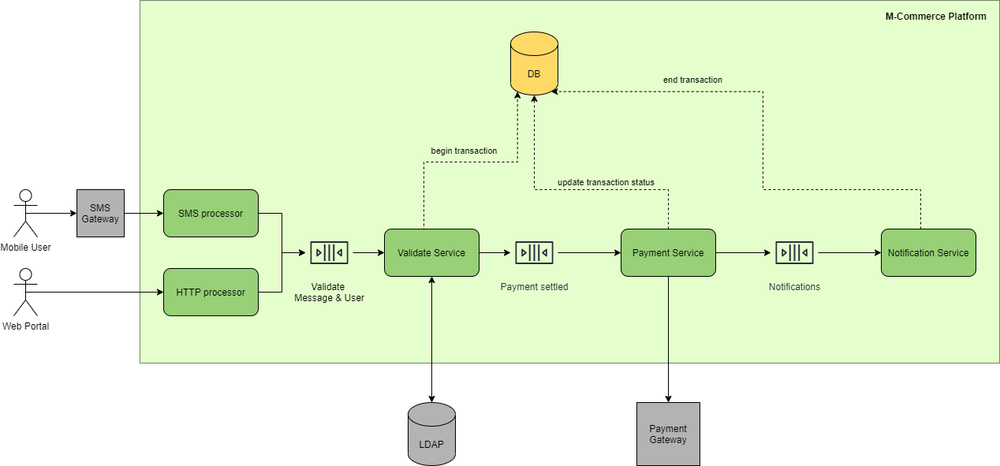

# M-commerce

## Main scenarios
- Mobile payment platform for airtransfer and mparking
- Mobile platform for other, different, payment cases: mbanking, mkiosk

## Deployment requirements
- IBM AIX virtualization

## Architecture sketch
