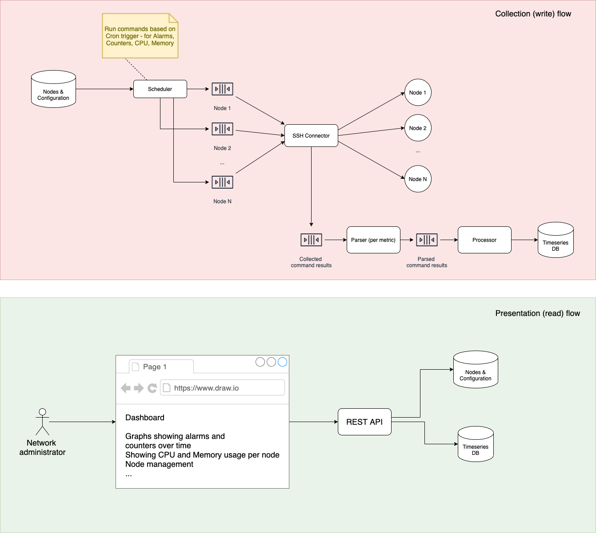

# UDC Dashboard

## Main scenarios
- Collect different metrics (like alarms, counters, cpu and memory usage) from nodes - databases in telecom network
- Display data to user with possibility to go back in time up to one year (playback functionality)

## Deployment requirements
- VM with Redhat 7
- Max 10 CPU cores
- Max 32GB RAM
- Max 512GB disk space

## Architecture sketch
